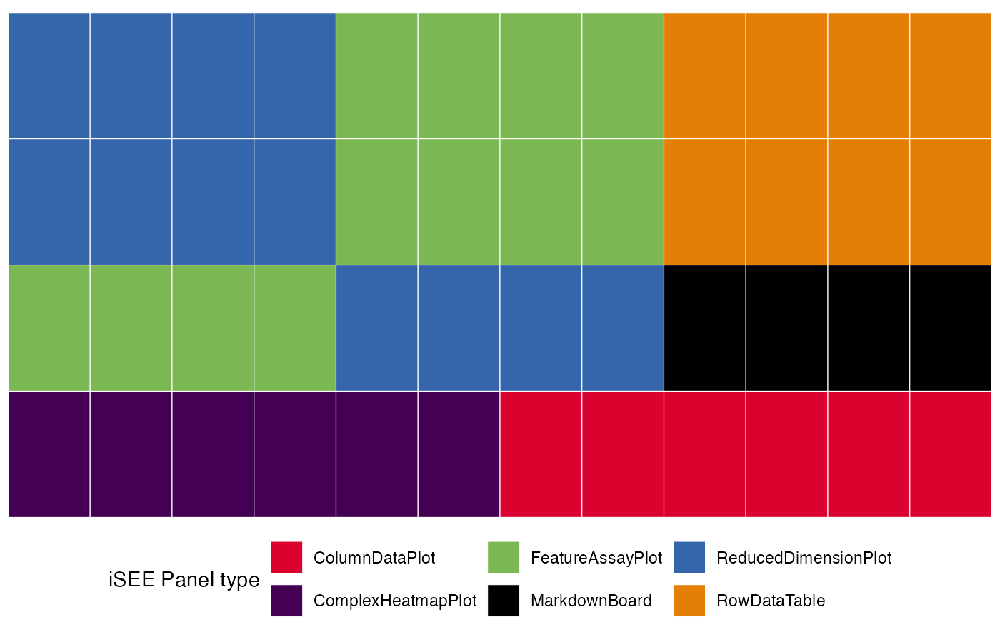
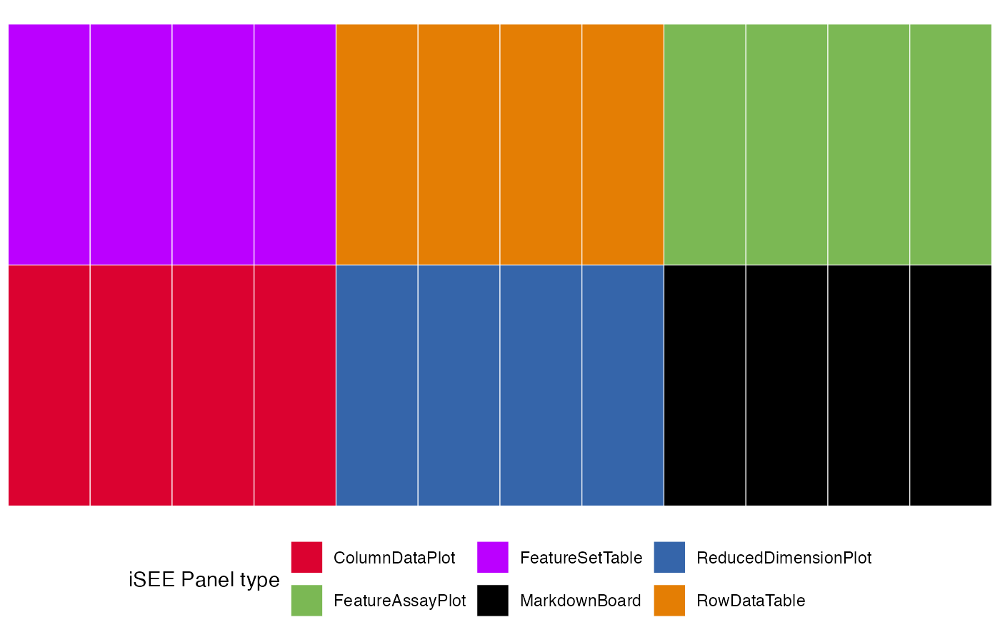
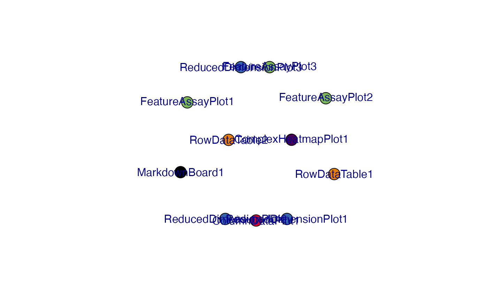
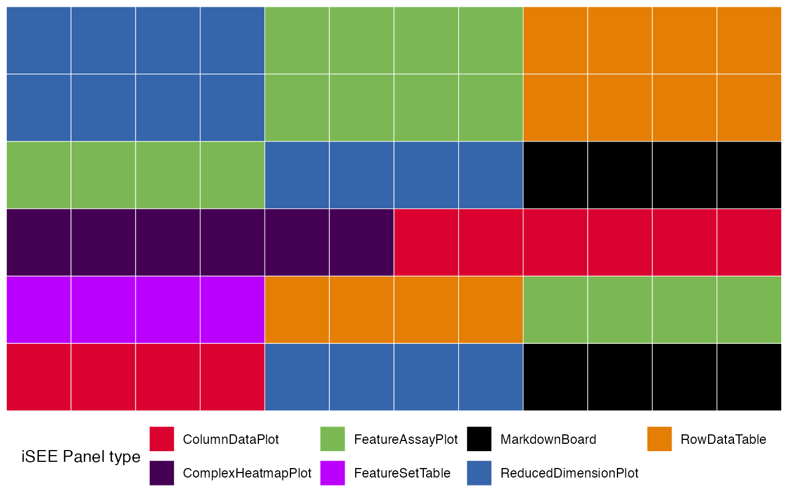

# The \`iSEEfier\` User's Guide

## Introduction

This vignette describes how to use the
*[iSEEfier](https://bioconductor.org/packages/3.24/iSEEfier)* package to
configure various initial states of iSEE instances, in order to simplify
the task of visualizing single-cell RNA-seq, bulk RNA-seq data, or even
your proteomics data in
*[iSEE](https://bioconductor.org/packages/3.24/iSEE)*. In the remainder
of this vignette, we will illustrate the main features of
`r BiocStyle::Biocpkg("iSEEfier")` on a publicly available dataset from
Baron et al. “A Single-Cell Transcriptomic Map of the Human and Mouse
Pancreas Reveals Inter- and Intra-cell Population Structure”, published
in Cell Systems in 2016.
[doi:10.1016/j.cels.2016.08.011](https://doi.org/10.1016/j.cels.2016.08.011).
The data is made available via the
*[scRNAseq](https://bioconductor.org/packages/3.24/scRNAseq)*
Bioconductor package. We’ll simply use the mouse dataset, consisting of
islets isolated from five C57BL/6 and ICR mice. \# Getting started
{#gettingstarted} To install
*[iSEEfier](https://bioconductor.org/packages/3.24/iSEEfier)* package,
we start R and enter:

``` r

if (!requireNamespace("BiocManager", quietly = TRUE))
  install.packages("BiocManager")
BiocManager::install("iSEEfier")
```

Once installed, the package can be loaded and attached to the current
workspace as follows:

``` r

library("iSEEfier")
```

## Create an initial state for gene expression visualization using `iSEEinit()`

When we have all input elements ready, we can create an `iSEE` initial
state by running:

``` r

iSEEinit(sce = sce_obj,
         features = feature_list,
         reddim.type = reduced_dim,
         clusters = cluster,
         groups = group,
         add_markdown_panel = FALSE)
```

To configure the initial state of our `iSEE` instance using
[`iSEEinit()`](../reference/iSEEinit.md), we need five parameters:

1.  `sce` : A `SingleCellExperiment` object. This object stores
    information of different quantifications (counts, log-expression…),
    dimensionality reduction coordinates (t-SNE, UMAP…), as well as some
    metadata related to the samples and features. We’ll start by loading
    the `sce` object:

``` r

library("scRNAseq")
sce <- BaronPancreasData('mouse')
sce
#> class: SingleCellExperiment 
#> dim: 14878 1886 
#> metadata(0):
#> assays(1): counts
#> rownames(14878): X0610007P14Rik X0610009B22Rik ... Zzz3 l7Rn6
#> rowData names(0):
#> colnames(1886): mouse1_lib1.final_cell_0001 mouse1_lib1.final_cell_0002
#>   ... mouse2_lib3.final_cell_0394 mouse2_lib3.final_cell_0395
#> colData names(2): strain label
#> reducedDimNames(0):
#> mainExpName: NULL
#> altExpNames(0):
```

Let’s add the normalized counts

``` r

library("scuttle")
sce <- logNormCounts(sce)
```

Now we can add different dimensionality reduction coordinates

``` r

library("scater")
sce <- runPCA(sce)
sce <- runTSNE(sce)
sce <- runUMAP(sce)
```

Now our `sce` is ready, we can move on to the next argument.

2.  `features` : which is a vector or a dataframe containing the
    genes/features of interest. Let’s say we would like to visualize the
    expression of some genes that were identified as marker genes for
    different cell population.

``` r

gene_list <- c("Gcg", # alpha
               "Ins1") # beta
```

3.  `reddim_type` : In this example we decided to plot our data as a
    t-SNE plot.

``` r

reddim_type <- "TSNE"
```

4.  `clusters` : Now we specify what clusters/cell-types/states/samples
    we would like to color/split our data with

``` r

# cell populations
cluster <- "label" #the name should match what's in the colData names
```

5.  `groups` : Here we can add the groups/conditions/cell-types

``` r

# ICR vs C57BL/6
group <- "strain" #the name should match what's in the colData names
```

We can choose to include in this initial step a `MarkdownBoard` by
setting the arguments `add_markdown_panel` to `TRUE`. At this point, all
the elements are ready to be transferred into
[`iSEEinit()`](../reference/iSEEinit.md)

``` r

initial1 <- iSEEinit(sce = sce,
                    features = gene_list,
                    clusters = cluster,
                    groups = group,
                    add_markdown_panel = TRUE)
```

In case our `features` parameter was a data.frame, we could assign the
name of the column containing the features to the `gene_id` parameter.

Now we are one step away from visualizing our list of genes of interest.
All that’s left to do is to run `iSEE` with the initial state created
with [`iSEEinit()`](../reference/iSEEinit.md)

``` r

library("iSEE")
iSEE(sce, initial= initial1)
```

This instance, generated with [`iSEEinit()`](../reference/iSEEinit.md),
returns a combination of panels, linked to each other, with the goal of
visualizing the expression of certain marker genes in each cell
population/group:

- A `ReducedDimensionPlot`, `FeatureAssayPlot` and `RowDataTable` for
  each single gene in `features`.
- A `ComplexHeatmapPlot` with all genes in `features`
- A `ColumnDataPlot` panel
- A `MarkdownBoard` panel

## Create an initial state for feature sets exploration using `iSEEnrich()`

Sometimes it is interesting to look at some specific feature sets and
the associated genes. That’s when the utility of `iSEEnrich` becomes
apparent. We will need 4 elements to explore feature sets of interest:

- `sce`: A SingleCellExperiment object
- `collection`: A character vector specifying the gene set collections
  of interest (it is possible to use GO or KEGG terms)
- `gene_identifier`: A character string specifying the identifier to use
  to extract gene IDs for the organism package. This can be **“ENS”**
  for ENSEMBL ids, **“SYMBOL”** for gene names…
- `organism`: A character string of the `org.*.eg.db` package to use to
  extract mappings of gene sets to gene IDs.
- `reddim_type`: A string vector containing the dimensionality reduction
  type
- `clusters`: A character string containing the name of the
  clusters/cell-type/state…(as listed in the colData of the sce)
- `groups`: A character string of the groups/conditions…(as it appears
  in the colData of the sce)

``` r

GO_collection <- "GO"
Mm_organism <- "org.Mm.eg.db"
gene_id <- "SYMBOL"
cluster <- "label"
group <- "strain"
reddim_type <- "PCA"
```

Now let’s create this initial setup for `iSEE` using
[`iSEEnrich()`](../reference/iSEEnrich.md)

``` r

results <- iSEEnrich(
  sce = sce,
  collection = GO_collection,
  gene_identifier = gene_id,
  organism = Mm_organism,
  clusters = cluster,
  reddim_type = reddim_type,
  groups = group
)
```

`iSEEnrich` will specifically return a list with the updated `sce`
object and its associated `initial` configuration. To start the `iSEE`
instance we run:

``` r

iSEE(results$sce, initial = results$initial)
```

## Create an initial state for marker gene exploration using `iSEEmarker()`

In many cases, we are interested in determining the identity of our
clusters, or further subset our cells types. That’s where
[`iSEEmarker()`](../reference/iSEEmarker.md) comes in handy. Similar to
[`iSEEinit()`](../reference/iSEEinit.md), we need the following
parameters:

- `sce`: a `SingleCellExperiment` object
- `clusters`: the name of the clusters/cell-type/state
- `groups`: the groups/conditions
- `selection_plot_format`: the class of the panel that we will be using
  to select the clusters of interest.

``` r

initial3 <- iSEEmarker(
  sce = sce,
  clusters = cluster,
  groups = group,
  selection_plot_format = "ColumnDataPlot")
```

This function returns a list of panels, with the goal of visualizing the
expression of marker genes selected from the `DynamicMarkerTable` in
each cell cell type. Unlike [`iSEEinit()`](../reference/iSEEinit.md),
which requires us to specify a list of genes,
[`iSEEmarker()`](../reference/iSEEmarker.md) utilizes the
`DynamicMarkerTable` that performs statistical testing through the
`findMarkers()` function from the
*[scran](https://bioconductor.org/packages/3.24/scran)* package. To
start exploring the marker genes of each cell type with `iSEE`, we run:

``` r

iSEE(sce, initial = initial3)
```

## Visualize a preview of the initial configurations with `view_initial_tiles()`

Previously, we successfully generated three distinct initial
configurations for iSEE. However, understanding the expected content of
our iSEE instances is not always straightforward. That’s when we can use
[`view_initial_tiles()`](../reference/view_initial_tiles.md). We only
need as an input the initial configuration to obtain a graphical
visualization of the expected the corresponding `iSEE` instance:

``` r

library(ggplot2)
view_initial_tiles(initial = initial1)
```



``` r

view_initial_tiles(initial = results$initial)
```



## Visualize network connections between panels with `view_initial_network()`

As some of these panels are linked to each other, we can visualize these
networks with
[`view_initial_network()`](../reference/view_initial_network.md).
Similar to `iSEEconfigviewer()`, this function takes the initial setup
as input: This function always returns the `igraph` object underlying
the visualizations that can be displayed as a side effect.

``` r

library("igraph")
library("visNetwork")
g1 <- view_initial_network(initial1, plot_format = "igraph")
```



``` r

g1
#> IGRAPH fd1451c DN-- 11 3 -- 
#> + attr: name (v/c), color (v/c)
#> + edges from fd1451c (vertex names):
#> [1] ReducedDimensionPlot1->ColumnDataPlot1  
#> [2] ReducedDimensionPlot2->ColumnDataPlot1  
#> [3] ReducedDimensionPlot3->FeatureAssayPlot3
initial2 <- results$initial
g2 <- view_initial_network(initial2, plot_format = "visNetwork")
```

## Merge different initial configurations with `glue_initials()`

Sometimes, it would be interesting to merge different `iSEE` initial
configurations to visualize all different panel in the same `iSEE`
instance.

``` r

merged_config <- glue_initials(initial1,initial2)
```

We can then preview the content of this initial configuration

``` r

view_initial_tiles(merged_config)
```



## Related work

The idea of launching
[`iSEE()`](https://isee.github.io/iSEE/reference/iSEE.html) with some
specific configuration is not entirely new, and it was covered in some
use cases by the `mode_` functions available in the
*[iSEEu](https://bioconductor.org/packages/3.24/iSEEu)* package. There,
the user has access to the following:

- [`iSEEu::modeEmpty()`](https://rdrr.io/pkg/iSEEu/man/modeEmpty.html) -
  this will launch `iSEE` without any panels, and let you build up the
  configuration from the scratch. Easy to start, easy to build.
- [`iSEEu::modeGating()`](https://rdrr.io/pkg/iSEEu/man/modeGating.html) -
  this will open `iSEE` with multiple chain-linked FeatureExpressionPlot
  panels, just like when doing some in silico gating. This could be a
  very good fit if working with mass cytometry data.
- [`iSEEu::modeReducedDim()`](https://rdrr.io/pkg/iSEEu/man/modeReducedDim.html) -
  `iSEE` will be ready to compare multiple ReducedDimensionPlot panels,
  which is a suitable option to compare the views resulting from
  different embeddings (and/or embeddings generated with slightly
  different parameter configurations). The `mode`s directly launch an
  instance of `iSEE`, whereas the functionality in
  *[iSEEfier](https://bioconductor.org/packages/3.24/iSEEfier)* is
  rather oriented to obtain more tailored-to-the-data-at-hand `initial`
  objects, that can subsequently be passed as an argument to the
  [`iSEE()`](https://isee.github.io/iSEE/reference/iSEE.html) call. We
  encourage users to submit suggestions about their “classical ways” of
  using `iSEE` on their data - be that by opening an issue or already
  proposing a Pull Request on GitHub.

## Session info

``` r

sessionInfo()
#> R version 4.6.0 (2026-04-24)
#> Platform: aarch64-apple-darwin23
#> Running under: macOS Sequoia 15.7.2
#> 
#> Matrix products: default
#> BLAS:   /Library/Frameworks/R.framework/Versions/4.6/Resources/lib/libRblas.0.dylib 
#> LAPACK: /Library/Frameworks/R.framework/Versions/4.6/Resources/lib/libRlapack.dylib;  LAPACK version 3.12.1
#> 
#> locale:
#> [1] en_US.UTF-8/en_US.UTF-8/en_US.UTF-8/C/en_US.UTF-8/en_US.UTF-8
#> 
#> time zone: Europe/Berlin
#> tzcode source: internal
#> 
#> attached base packages:
#> [1] stats4    stats     graphics  grDevices utils     datasets  methods  
#> [8] base     
#> 
#> other attached packages:
#>  [1] visNetwork_2.1.4            igraph_2.3.1               
#>  [3] scater_1.41.1               ggplot2_4.0.3              
#>  [5] scuttle_1.21.6              scRNAseq_2.27.0            
#>  [7] SingleCellExperiment_1.35.0 SummarizedExperiment_1.43.0
#>  [9] Biobase_2.73.1              GenomicRanges_1.65.0       
#> [11] Seqinfo_1.3.0               IRanges_2.45.0             
#> [13] S4Vectors_0.51.1            BiocGenerics_0.59.0        
#> [15] generics_0.1.4              MatrixGenerics_1.25.0      
#> [17] matrixStats_1.5.0           iSEEfier_1.9.0             
#> [19] BiocStyle_2.41.0           
#> 
#> loaded via a namespace (and not attached):
#>   [1] splines_4.6.0            later_1.4.8              BiocIO_1.23.3           
#>   [4] bitops_1.0-9             filelock_1.0.3           tibble_3.3.1            
#>   [7] XML_3.99-0.23            lifecycle_1.0.5          httr2_1.2.2             
#>  [10] doParallel_1.0.17        lattice_0.22-9           ensembldb_2.37.0        
#>  [13] alabaster.base_1.13.0    magrittr_2.0.5           sass_0.4.10             
#>  [16] rmarkdown_2.31           jquerylib_0.1.4          yaml_2.3.12             
#>  [19] httpuv_1.6.17            otel_0.2.0               DBI_1.3.0               
#>  [22] RColorBrewer_1.1-3       abind_1.4-8              Rtsne_0.17              
#>  [25] AnnotationFilter_1.37.0  RCurl_1.98-1.18          rappdirs_0.3.4          
#>  [28] circlize_0.4.18          ggrepel_0.9.8            irlba_2.3.7             
#>  [31] alabaster.sce_1.13.0     RSpectra_0.16-2          pkgdown_2.2.0           
#>  [34] iSEEhex_1.15.0           codetools_0.2-20         DelayedArray_0.39.1     
#>  [37] DT_0.34.0                tidyselect_1.2.1         shape_1.4.6.1           
#>  [40] UCSC.utils_1.9.0         farver_2.1.2             viridis_0.6.5           
#>  [43] ScaledMatrix_1.21.0      shinyWidgets_0.9.1       BiocFileCache_3.3.0     
#>  [46] GenomicAlignments_1.49.0 jsonlite_2.0.0           BiocNeighbors_2.7.1     
#>  [49] GetoptLong_1.1.1         iterators_1.0.14         systemfonts_1.3.2       
#>  [52] foreach_1.5.2            tools_4.6.0              ragg_1.5.2              
#>  [55] Rcpp_1.1.1-1.1           glue_1.8.1               gridExtra_2.3           
#>  [58] SparseArray_1.11.13      BiocBaseUtils_1.15.0     xfun_0.57               
#>  [61] mgcv_1.9-4               GenomeInfoDb_1.49.0      dplyr_1.2.1             
#>  [64] HDF5Array_1.41.0         gypsum_1.9.0             shinydashboard_0.7.3    
#>  [67] withr_3.0.2              BiocManager_1.30.27      fastmap_1.2.0           
#>  [70] rhdf5filters_1.25.0      shinyjs_2.1.1            rsvd_1.0.5              
#>  [73] digest_0.6.39            R6_2.6.1                 mime_0.13               
#>  [76] textshaping_1.0.5        colorspace_2.1-2         listviewer_4.0.0        
#>  [79] dichromat_2.0-0.1        RSQLite_3.52.0           cigarillo_1.3.0         
#>  [82] h5mread_1.5.0            hexbin_1.28.5            FNN_1.1.4.1             
#>  [85] rtracklayer_1.73.0       httr_1.4.8               htmlwidgets_1.6.4       
#>  [88] S4Arrays_1.13.0          org.Mm.eg.db_3.23.0      uwot_0.2.4              
#>  [91] iSEE_2.25.0              pkgconfig_2.0.3          gtable_0.3.6            
#>  [94] blob_1.3.0               ComplexHeatmap_2.29.0    S7_0.2.2                
#>  [97] XVector_0.53.0           htmltools_0.5.9          bookdown_0.46           
#> [100] ProtGenerics_1.45.0      rintrojs_0.3.4           clue_0.3-68             
#> [103] scales_1.4.0             alabaster.matrix_1.13.0  png_0.1-9               
#> [106] knitr_1.51               rstudioapi_0.18.0        rjson_0.2.23            
#> [109] nlme_3.1-169             curl_7.1.0               shinyAce_0.4.4          
#> [112] cachem_1.1.0             rhdf5_2.57.0             GlobalOptions_0.1.4     
#> [115] BiocVersion_3.24.0       parallel_4.6.0           miniUI_0.1.2            
#> [118] vipor_0.4.7              AnnotationDbi_1.75.0     restfulr_0.0.16         
#> [121] desc_1.4.3               pillar_1.11.1            grid_4.6.0              
#> [124] alabaster.schemas_1.13.0 vctrs_0.7.3              promises_1.5.0          
#> [127] BiocSingular_1.29.0      dbplyr_2.5.2             iSEEu_1.25.0            
#> [130] beachmat_2.29.0          xtable_1.8-8             cluster_2.1.8.2         
#> [133] beeswarm_0.4.0           evaluate_1.0.5           GenomicFeatures_1.65.0  
#> [136] cli_3.6.6                compiler_4.6.0           Rsamtools_2.29.0        
#> [139] rlang_1.2.0              crayon_1.5.3             ggbeeswarm_0.7.3        
#> [142] fs_2.1.0                 viridisLite_0.4.3        alabaster.se_1.13.0     
#> [145] BiocParallel_1.47.0      Biostrings_2.81.1        lazyeval_0.2.3          
#> [148] colourpicker_1.3.0       Matrix_1.7-5             ExperimentHub_3.3.0     
#> [151] bit64_4.8.0              Rhdf5lib_2.1.0           KEGGREST_1.53.0         
#> [154] shiny_1.13.0             alabaster.ranges_1.13.0  AnnotationHub_4.1.0     
#> [157] memoise_2.0.1            bslib_0.10.0             bit_4.6.0
```
